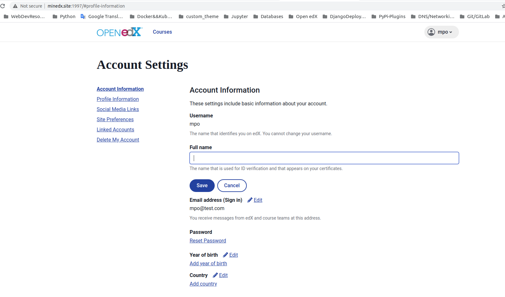

## Plugin for frontend-app-account
This is a micro-frontend application responsible for the display and updating of a user's account information.

#### Cloning and configuring Frontend-app-account

`$ git clone -b murat https://github.com/NTNUbeta/frontend-app-account `

Than edit
`https://github.com/NTNUbeta/frontend-app-account/blob/murat/.env.development` file with your environment values, push back to GitHub.

### Installation:

If using virtualenv:

`$ python3 -m venv ~/tutor`

`$ source ~/tutor/bin/activate`

 Cloning and installing plugin

`$ https://github.com/NTNUbeta/tutor-account `

`$ pip3 install -e tutor-account`

`$ tutor plugins list`

`$ tutor plugins enable account`

Building new Docker services for Tutor

`$ tutor images build account`

`$ tutor local quickstart `

visit http://yourdomain.com:1997

